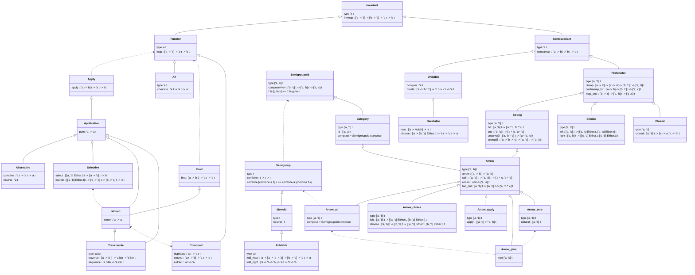

# Typeclassopedia

```mermaid
classDiagram-v2
    %% Monoid hierarchy
    %% 

    class Semigroup {
        type t
        combine : t -> t -> t
        combine [combine a b] c == combine a [combine b c]
    }

    class Monoid {
        type t
        neutral : t
    }

    Semigroup <|-- Monoid

    %% Functor hierarchy
    %% 

    class Invariant {
        type 'a t
        invmap : ['a -> 'b] -> ['b -> 'a] -> 'a t -> 'b t
    }

    class Functor {
        type 'a t
        map : ['a -> 'b] -> 'a t -> 'b t
    }

    class Alt {
        type 'a t
        combine : 'a t -> 'a t -> 'a t
    }

    %%    map : ['a -> 'b] -> 'a t -> 'b t = Functor.map 
    %%    product : 'a t * 'b t -> ['a * 'b] t
    %%    lift2 : ['a -> 'b -> 'c] -> 'a t -> 'b t -> 'c t
    class Apply {
        apply : ['a -> 'b] t -> 'a t -> 'b t
    }

    class Applicative {
        pure: 'a -> 'a t
    }

    class Alternative {
        combine : 'a t -> 'a t -> 'a t
        neutral : 'a t
    }

    class Selective {
        select : [['a, 'b] Either.t] t -> ['a -> 'b] t -> 'b t
        branch : [['a, 'b] Either.t] t -> ['a -> 'c] t -> ['b -> 'c] t -> 'c t
    }

    %% map : ['a -> 'b] -> 'a t -> 'b t
    %% join : 'a t t -> 'a t
    class Bind {
        bind: ['a -> 'b t] -> 'a t -> 'b t
    }

    class Monad {
        return : 'a -> 'a t
    }

    
    class Foldable {
        type 'a t
        fold_map' : 'a -> ['a -> 'a -> 'a] -> ['b -> 'a] -> 'b t -> 'a
        fold_right : ['a -> 'b -> 'b] -> 'a t -> 'b -> 'b
    }

    %% traverse : Map each element of a structure to an action, evaluate these actions from left to right, and collect the results. *
    %% sequence : Evaluate each action in the structure from left to right, and collect the results
    class Traversable {
        type 'a iter
        traverse : ['a -> 'b t] -> 'a iter -> 'b iter t
        sequence : 'a t iter -> 'a iter t
    }

    %% map : ['a -> 'b] -> 'a t -> 'b t = Functor.map 
    class Comonad {
        duplicate : 'a t -> 'a t t
        extend : ['a t -> 'b] -> 'a t -> 'b t
        extract : 'a t -> 'a
    }

    Invariant <|-- Functor
    Functor <.. Apply
    Functor <|-- Alt
    Apply <|-- Applicative
    Applicative <|-- Alternative
    Applicative <|-- Selective
    Functor <.. Bind
    Bind <|-- Monad
    Applicative <|-- Monad
    Selective <.. Monad
    Applicative <|-- Traversable
    Monad <|-- Traversable
    Functor <|-- Comonad
    Monad <..> Comonad
    Monoid <|-- Foldable


    %% Contravariant functor hierarchy
    %% 

    class Contravariant {
        type 'a t
        contramap : ['a -> 'b] -> 'b t -> 'a t
    }

    class Divisible {
        conquer : 'a t
        divide : ['a -> 'b * 'c] -> 'b t -> 'c t -> 'a t
    }

    class Decidable {
        lose : ['a -> Void.t] -> 'a t
        choose : ['a -> ['b, 'c] Either.t] -> 'b t -> 'c t -> 'a t
    }

    
    Invariant <|-- Contravariant
    Contravariant <|-- Divisible
    Divisible <|-- Decidable

    %% Profunctor hierarchy
    %% 

    class Profunctor {
        type ['a ,'b] t
        dimap: ['a -> 'b] -> ['c -> 'd] -> ['b, 'c] t -> ['a, 'd] t
        contramap_fst : ['a -> 'b] -> ['b, 'c] t -> ['a, 'c] t
        map_snd : ['b -> 'c] -> ['a, 'b] t -> ['a ,'c] t
    }

    class Strong {
        type ['a, 'b] t
        fst : ['a, 'b] t -> ['a * 'c, 'b * 'c] t
        snd : ['b, 'c] t -> ['a * 'b, 'a * 'c] t
        uncurry@ : ['a, 'b * 'c] t -> ['a * 'b, 'c] t
        strong@ : ['a -> 'b -> 'c] -> ['a, 'b] t -> ['a, 'c] t
    }

    class Choice {
        type ['a, 'b] t
        left : ['a, 'b] t -> [['a, 'c] Either.t, ['b, 'c] Either.t] t
        right : ['a, 'b] t -> [['c, 'a] Either.t, ['c, 'b] Either.t] t
    }

    class Closed {
        type ['a, 'b] t
        closed : ['a, 'b] t -> ['c -> 'a, 'c -> 'b] t
    }

    Contravariant <|-- Profunctor    
    Profunctor <|-- Strong
    Profunctor <|-- Choice
    Profunctor <|-- Closed

    %% Arrow hierarchy
    %% 

    %% 半广群
    class Semigroupoid {
        type ['a, 'b] t
        compose<%> : ['b, 'c] t -> ['a, 'b] t -> ['a, 'c] t
        f % [g % h] == [f % g] % h
    }

    class Category {
        type ['a, 'b] t
        id : ['a, 'a] t
        compose = Semigroupoid.compose
    }

    class Arrow {
        type ['a, 'b] t
        arrow : ['a -> 'b] -> ['a, 'b] t
        split : ['a, 'b] t -> ['c, 'd] t -> ['a * 'c, 'b * 'd] t
        return : unit -> ['a, 'a] t
        fan_out : ['a, 'b] t -> ['a, 'c] t -> ['a, 'b * 'c] t
    }

    class Arrow_alt {
        type ['a, 'b] t
        compose = Semigroupoid.compose
    }

    %%  It is a kind of Selective in the arrow hierarchy.
    class Arrow_choice {
        type ['a, 'b] t
        left : ['a, 'b] t -> [['a, 'c] Either.t, ['b, 'c] Either.t] t
        choose : ['a, 'b] t -> ['c, 'd] t -> [['a, 'c] Either.t, ['b, 'd] Either.t] t
    }

    class Arrow_apply {
        type ['a, 'b] t
        apply : [['a, 'b] t * 'a, 'b] t
    }

    class Arrow_plus {
        type ['a, 'b] t
    }

    class Arrow_zero {
        type ['a, 'b] t
        natural : ['a, 'b] t
    }

    Semigroupoid <.. Semigroup
    Semigroupoid <|-- Category
    Category <|-- Arrow
    Strong <|-- Arrow

    Arrow <|-- Arrow_alt
    Arrow <|-- Arrow_choice
    Arrow <|-- Arrow_apply
    Arrow <|-- Arrow_plus
    Arrow <|-- Arrow_zero

    Semigroup <.. Arrow_alt
    Arrow_alt <.. Arrow_plus
    Arrow_zero <.. Arrow_plus
```