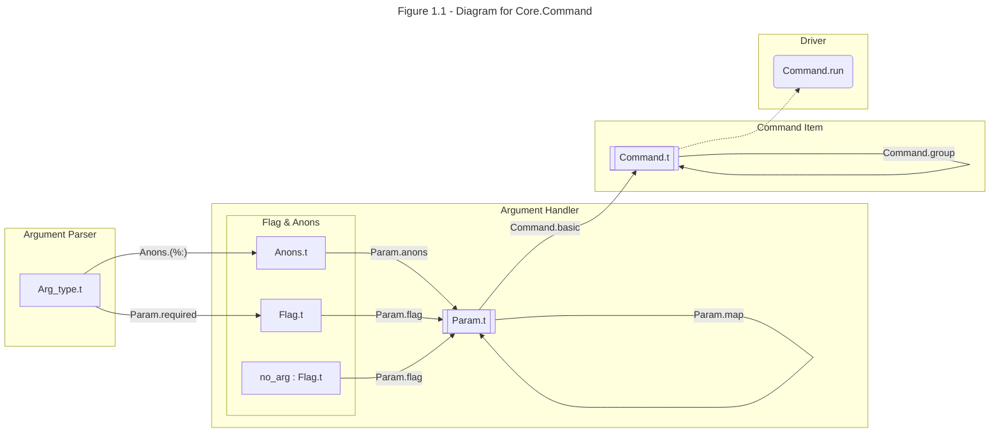
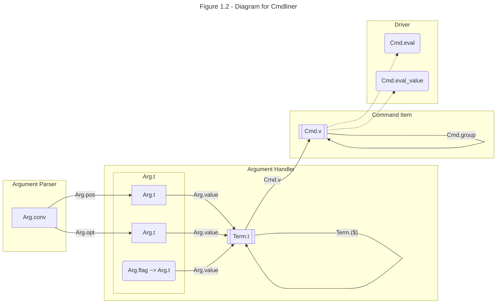

# Understanding `Core.Command` and `Cmdliner`

## Introduction

Command-line parse libraries e.g. `Core.Command` and `Cmdliner` is notoriously difficult to understand and use. The tension may come from sometimes people require a quick solution, while both these libraries target to be full-feathered tools with abstractions and concepts. This post aims to provide a understanding guide for them. Their official tutorials are at [RWO/Command-Line Parsing](https://dev.realworldocaml.org/command-line-parsing.html) and [cmdliner/tutorial](https://erratique.ch/software/cmdliner/doc/tutorial.html). I hope you can be much clear to back to them after reading this guide.

## Four Concepts

Both libraires provide four level of concepts:

| Concept          | Stage  | Composable | Core.Command     | Cmdliner                               |
| ---------------- | ------ | ---------- | ---------------- | -------------------------------------- |
| Argument Parser  | Step 3 | no         | `'a Arg_type.t`  | `'a Arg.conv = 'a parser * 'a printer` |
| Argument Handler | Step 3 | yes        | `'a Param.t`     | `'a Term.t`                            |
| Command Item     | Step 2 | yes        | `unit Command.t` | `'a Cmd.t`                             |
| Driver           | Step 1 | no         | `Command.run`    | `Cmd.eval`,  `Cmd.eval_value`          |

<div style="text-align: center"> Table 1 - Concepts for Core.Command and Cmdliner </div>

**Argument Parser** provides functions to parse a raw string to the expected type. They both provides some common usage parsers inside [Core/Command/Spec](https://v3.ocaml.org/p/core/latest/doc/Core/Command/Spec/index.html#val-string) and [Cmdliner/Predefined_converters](https://erratique.ch/software/cmdliner/doc/Cmdliner/Arg/index.html#converters). `Cmdliner.Arg.conv` is a design choice to pair a printer with a parser.

**Argument Handler** fulfills parsers with extra properties to handle command-line argument e.g. it's required or optional, with a flag or not, the doc string for it. **Parsing** may be the central work for an argument but a **handler** is the small complete unit in both libraries.

**Argument Handler** may not need **Parsing** in examples that a flag argument carries no values. The existence or not means a boolean parameter e.g. `-v` (rather than `-log=WARNING`).

Both libraries, **Argument Handlers** are not directed used by **Drivers**. **Argument Handlers** are wrapped into a **Command Item** and **drivers** take **Command Item** and do the real parsing work. A **Command Item** for a whole sub-command .e.g `push ...` in `git push ...`. You may have separate sub-commands for `git clone`, `git pull` and you need to group these **Command Items** into a compound **Command Items**.

Column **stage** in the table lists the order during a real command-line parsing. 

- Step 1: **Driver** are usually the unique top function of your program. It takes the `Sys.argv` and invodes your `Command Item`.
- Step 2: **Driver** dispatches to the **Command Item**.
- Step 3: **Argument Handler** performs the parsing and handling.

## Driver functions

`Core.Command` is only in charge to build a `Command.t` and it doesn't provide any driver functions. The driver function `Core.Command.run` is in another library `core_unix.command_unix`. It takes the `Core.Command.t` and start the work.

`Cmdliner` has a variant of driver functions `Cmd.eval` and `Cmd.eval_value`. Since they're supposed to be the unique top functions, `Cmd.eval` returns a `unit` while `Cmd.eval` returns a `int` (standard error code) that is used by `exit`. 

It's a common myth that people including me seek to get the unboxed parsed result. Such a function is not even provided in `Core.Command`. It's do-able with `Cmdliner.Cmd.eval_value : ... -> ?argv:string array -> 'a Cmd.t -> ('a Cmd.eval_ok, Cmd.eval_error) result`. However, you need to tokenize to get `argv` yourself (Imparient readers can jump to Section [Elimination](#elimination)).

## Diagrams for `Core.Command` and `Cmdliner`

Both `Core.Command` and `Cmdliner` have two-layered compositional datatypes. An element in the inner layer is to parse one key-value pair (or key-only or value-only). For example, we're going to parse `-v -a=1 -b=t 42`.

The inner layer for `Core.Command` is a compositional `Param.t`. We will have four `Param.t` that are

- `bool Param.t` for `-v`
- `int Param.t` for `-a=1` in which a `int Arg_type` to parse `1`
- `string Param.t` for `-b=t` in which a `string Arg_type` to parse `t`
- `int Param.t` for `42` in which a `int Arg_type` to parse `42`

The inner layer for `Cmdliner` is a compositional `Term.t`. We will have four `Term.t` that are

- `bool Term.t` for `-v`
- `int Term.t` for `-a=1` in which a `int Arg.conv` to parse `1`
- `string Term.t` for `-b=t` in which a `string Arg.conv` to parse `t`
- `int Term.t` for `42` in which a `int Arg.conv` to parse `42`

The inner layer data are wrapped into outer layer data `Core.Command.t` or `Cmdliner.Cmd.t` via packing function `Core.Command.basic` or `Cmdliner.Cmd.v`. A outer layer data is usually used for argparsing one command-line case. It is also composable and is used to group sub-commands. [`Core.Command.group`](https://v3.ocaml.org/p/core/latest/doc/Core/Command/index.html#val-group) takes `(string * Core.Command.t) list` and returns a `Core.Command.t`. [`Cmdlinder.Cmd.group`](https://erratique.ch/software/cmdliner/doc/Cmdliner/Cmd/index.html#val-group) takes `Cmdliner.Cmd.t list` and returns a `Cmdliner.Cmd.t`.

Their diagrams are quite alike in the respective of our **four concepts**. I omit all the doc-related components to make it clear. A rectangle corespond to a type. A edge is a function that transforms datatype. A rounded rectangle is also a function but at an endpoint (It's rare. Only two driver functions and one `Arg.flag`). Four compositional datatypes `Param.t` `Command.t` `Term.t` `Cmd.t` should be in stacked rectangles (but here I just use a rectangle with double edges).





## How `Param.t` and `Term.t` are made

A `Core.Command.t` is consists of the _flagged_ parameters (or pure flags) and _anonymous_ (flag-less) parameters. A `Cmdlinder.t` is consists of _optional arguments_ and _positional arguments_. They are very similar correspondingly as **Argument Handlers**. **Argument Handlers** can use **Argument Parser**.

In `Core.Command`, A primitive `'a Param.t` can made up from ingridients

1. `'a Arg_type.t` parses `string` to `'a`
2. `'a Flag.t` can wrap `'a Arg_type.t` as `required`, `optional`, or `optional_with_default`
3. `'bool Flag.t` requires no `'a Arg_type.t`. Therefore its existence denotes a `true` or `false`
4. `'a Anons.t` which wraps `'a Arg_type.t`
5. `Param.flag` makes `'a Flag.t` a `'a Param.t`
6. `Param.anons` makes `'a Anons.t` a `'a Param.t`

In `Cmdlinder`, the ingridients to make up a primitive `'a Term.t` are:

1. `'a Arg.conv` defines both a parser and a printer for `'a`
2. `Arg.opt` wraps `'a Arg.conv` an optional flagged argument `'a Arg.t`.
3. `Arg.pos` wraps `'a Arg.conv` and makes a positional argument at certain index `'a Arg.t`
4. `Arg.flag` makes a pure flag optional argument `bool Arg.t`
5. `Arg.value` makes `'a Arg.t` a `'a Term.t`

The listing and the diagram are not complete, but they are sufficient to illuminate.

## Pack **Argument Handler** to **Command Ttem**

Driver functions takes a **Command Item**. It's packed from a **Argument Handler**. `Param.t` and `Term.t` can compose just like parser combinator or prettyprinter. They should be `Applicative` (or also `Contravariant` ?)

### Pack `Command.Param.t` to `Command.t`

The pack function for `Command` is `Command.basic`.

```ocaml
# #require "core";;
# open Core;;
# Command.Param.map;;
- : 'a Command.Spec.param -> f:('a -> 'b) -> 'b Command.Spec.param = <fun>

# #show Command.basic;;
val basic : unit Command.basic_command

# #show Command.basic_command;;
type nonrec 'result basic_command =
    summary:string ->
    ?readme:(unit -> string) ->
    (unit -> 'result) Command.Spec.param -> Command.t
```

Type `Command.Spec.param` is an alias for `Command.Param.t`. We can see the types for first argument and the return type of `Command.Param.map`, and the second-to-last argument of `Command.basic_command`, are all `Command.Param.t`. `'result` is set to be `unit` in `Command.basic`.

The task left for users is to provide a function that maps parsed result `'a Param.t` to `(unit -> unit) Param.t`.

The following two lines are equal. It's a partially applied `Param.map` from `string Param.t` to an unknown `~f : string -> '_weak`:

```ocaml
# Command.Param.(map (anon ("filename" %: string)));;
- : f:(string -> '_weak1) -> '_weak1 Command.Spec.param = <fun>

# Command.(let s : string Param.Arg_type.t = Param.string in let a = Anons.(%:) "filename" s in Param.map (Param.anon a));;
- : f:(string -> '_weak2) -> '_weak2 Command.Spec.param = <fun>
```

In the following example of `Command.basic`, our function `(fun file () -> ignore file)` satisfied the type requirement. The observation here is `Command.basic` requires an argument of type `(unit -> unit) Command.Spec.param`. The user code to consume the parsed result is usually like `Param.map a_b_c_param ~f:(fun a b c () -> ...; () ) : (unit -> unit) Command.Spec.param`. The parsed result is passed before the last argument `()`.

```ocaml
# Command.basic ~summary:"fairy file" Command.Param.(map (anon ("filename" %: string)) ~f:(fun file () -> ignore file));;
- : Command.t = <abstr>
```

To make it familiar to RWO readers, we use `let%map_open` instead of `Param.map`. The code is equivalent to the above one:

```ocaml
# #require "ppx_jane";;

# let%map_open.Command file = (anon ("filename" %: string)) in file;;
- : string Command.Spec.param = <abstr>

# Command.basic ~summary:"fairy file" (let%map_open.Command file = (anon ("filename" %: string)) in fun () -> ignore file);;
- : Command.t = <abstr>
```

### Pack `Cmdliner.Term.t` to `Cmdliner.Cmd.t`

`Cmdliner` uses _pure_ (`Term.const : 'a -> 'a t`) and _ap_ (`Term.($) : ('a -> 'b) t -> 'a t -> 'b t`) to compose `Term.t`. Unlike `Command.basic`, the user code to consume the parsed result is usually `Term.(const (fun a b c -> ...; () )) $ a_param $ b_param $ c_param : unit Term.t`. `Term.v` takes this value to get a `Cmd.t`, then this `Cmd.t` can be used in the driver function `Cmd.eval`.

```ocaml
# #require "cmdliner";;
# open Cmdliner;;

# let file = Arg.(value & pos 0 string "default_name" (Arg.info []));;
val file : string Term.t = <abstr>

# Cmd.v (Cmd.info "fairy file") Term.((const (fun filename -> ignore filename)) $ file );;
- : unit Cmd.t = <abstr>
```

The difference between their approaches is `Command` puts the _comsume-all_ function at last while `Cmdliner` puts it at first. They both use functional jargons e.g. `let%map_open`, `Anon.(%:)`, `Arg.(&)` and `Term.($)`. They help to compact the code, at the cost of confusing newcomers.

## Syntax for Command-line Languages

It's not explicitly specified, but their design and APIs suggest (or _check_) possible syntax for the command-line languages. e.g. for the flag-less parts, `Command` treats them as anonymous arguments and allow the a sequence of them. The run-time validity of `Param.t` is less powerful than its static type. In this example, Anonymous `int` after a list of anonymous `string` causes an exception for its syntax.

```ocaml
# let my_param = 
    (let%map_open.Command str_lst = anon (sequence ("str" %: string)) 
    and extra_int = anon ("int" %: int) in 
    fun () -> ());;
val my_param : (unit -> unit) Command.Spec.param = <abstr>

# Command.basic ~summary:"my_param" my_param ;;
Exception:
Failure
 "the grammar [STR ...] INT for anonymous arguments is not supported because there is the possibility for arguments (INT) following a variable number of arguments ([STR ...]).  Supporting such grammars would complicate the implementation significantly.".
Raised at Stdlib.failwith in file "stdlib.ml", line 29, characters 17-33
Called from Base__List0.fold in file "src/list0.ml", line 37, characters 27-37
Called from Command.Anons.Grammar.concat in file "command/src/command.ml", line 1000, characters 10-729
Called from Command.basic in file "command/src/command.ml", line 2373, characters 14-22
Called from Topeval.load_lambda in file "toplevel/byte/topeval.ml", line 89, characters 4-14
```

`Cmdliner` treats flag-less parts as positional arguments. The manual warns it's the user's _duty_ to ensure the unique use of a position. `Arg` provides functions to either preciously points to one position index, or to range all, or to cover the left/right to a given position index. Duplication of position index will trigger run-time exception.

```ocaml
# let top_t =
  let ai = Arg.info [] in
  let str_lst : string list Term.t = Arg.(value & pos_all string [] ai) in
  let extra_int : int Term.t = Arg.(value & pos 1 int 0 ai) in
  let handle_all : (string list -> int -> unit) Term.t =
    Term.const @@ fun _str_list _extra_int -> ()
  in
  Term.(handle_all $ str_lst $ extra_int);;
val top_t : unit Term.t = <abstr>

# let c =
  let i = Cmd.info "" in
  Cmd.v i top_t ;;
val c : unit Cmd.t = <abstr>

# Cmd.eval_value ~argv:[| "a"; "2" |] c;;
- : (unit Cmd.eval_ok, Cmd.eval_error) result = Stdlib.Ok (`Ok ())

# Cmd.eval_value ~argv:[| "a"; "b" |] c;;
: invalid value 'b', expected an integer
Usage:  [OPTION]… [ARG]…
Try ' --help' for more information.
- : (unit Cmd.eval_ok, Cmd.eval_error) result = Stdlib.Error `Parse
```

## Summary and Questions 

To recap, after skipping documenting, escaping, error code, auto-completing, two of the most popular command-line lianguages `Core.Command` and `Cmdliner` can be grasped via four concepts i.e. **Argument Parser**, **Argument Handler**, **Command Item**, and **Driver**. The [diagram](#diagrams-for-corecommand-and-cmdliner) not only shows their internal relation, but also reveal the similarity between them. I don't have time to re-comment all their documents and tutorials from my viewpoint, but I suggest to go back to them ((for [`Command`](https://dev.realworldocaml.org/command-line-parsing.html) and for [`Cmdliner`](https://erratique.ch/software/cmdliner/doc/tutorial.html))) after this post. 

Explicit syntax for for command-line languages and static safety typed parsing arise very interesting problems to me. I will delve into it in future posts.

## Elimination

For command-line parsing, OCaml has build-in `Sys.argv` and standard library `Arg` module ([tutorial](https://ocaml.org/docs/cli-arguments)).

⚠️ We can let `Core.Command` return the parsed result with a mutable reference, even its pack function and driver function requires a `unit` return value. When a functional program is [not](https://dl.acm.org/doi/pdf/10.1145/317636.317775) a functional program?

```ocaml
# let store = ref "" in 
  Command.basic ~summary:"fairy file" Command.Param.(map (anon ("filename" %: string)) ~f:(fun file () -> store := file; ()));;
- : Command.t = <abstr>
```