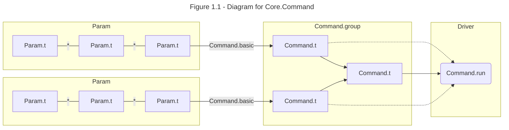
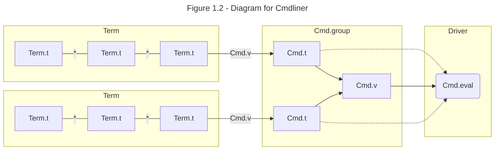
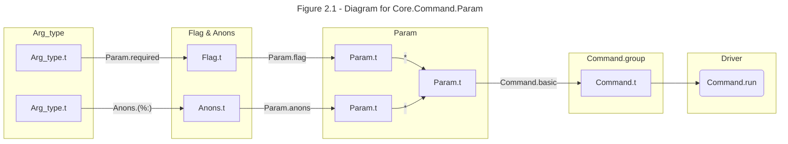
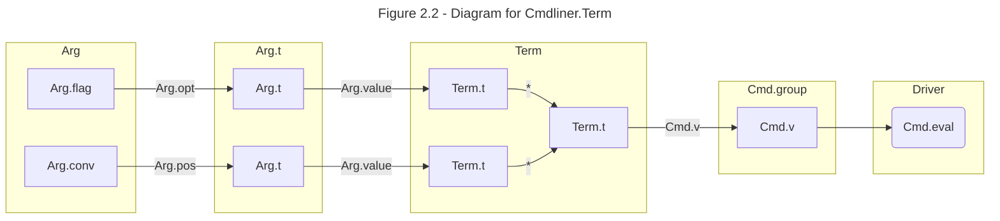

# Command-line Argparse

Unlike OCaml which itself is straightforward, command-line parse libraries e.g. `Core.Command` and `Cmdliner` in OCaml is notoriously difficult to understand and use. The tension may come from sometime people requires a quick solution, while both these libraries are shipping concepts and tools for a full-feathered tool. This post aims to provide alternative tutorials for them. Their official tutorials are at [RWO/Command-Line Parsing](https://dev.realworldocaml.org/command-line-parsing.html) and [cmdliner/tutorial](https://erratique.ch/software/cmdliner/doc/tutorial.html). OCaml also has build-in `Sys.argv` and standard library `Arg` module ([tutorial](https://ocaml.org/docs/cli-arguments)).

## What are the Driver Functions?

The first myth to break is they provide driver functions taking raw string of command-line and returning a parsing result. No!

`Core.Command` doesn't provide any driver functions at all. After all, `Core.Command` helps to build a `Command.t` which specifies:

- Step 2: how to parse command-line and get the parsed result
- Step 3: how to handle parsed result (and return a `unit`)

The driver function `Core.Command.run` , in `core_unix.command_unix`, takes the `Core.Command.t` and start the work:

- Step 1: take the commend-line `Sys.argv` and perform step 2 & 3.

`Cmdliner` has a variant of driver functions e.g. `Cmdliner.Cmd.eval` like the above step 1. They each takes a `Cmdliner.Cmd.t` like the above step 2 & 3 and returns a standard error code.

⚠️Warning: Since I don't understand the motivation of this design, I usually hack the driver functions and get the parsed result back via a mutable reference.

## How to Parse?

Both `Core.Command` and `Cmdliner` have two-layered compositional primitive functions

The inner layer for `Core.Command` is a compositional `Core.Command.Param.t` to compose single key-value parsing. e.g. a argparser for `-a=1 -b=t` is composed from a argparser for `-a=1` and a argparser `-b=t`. The inner layer for `Cmdliner` is a compositional `Cmdliner.Term.t`.

The inner layer data are wrapped into outer layer data `Core.Command.t` or `Cmdliner.Cmd.t` via packing function `Core.Command.basic` or `Cmdliner.Cmd.v`. A outer layer data is usually used for argparsing one command-line case. The outer layer data is also composable and are usually used to handle cases for sub-commands. [`Core.Command.group`](https://v3.ocaml.org/p/core/latest/doc/Core/Command/index.html#val-group) takes `(string * Core.Command.t) list` and returns a `Core.Command.t`. [`Cmdlinder.Cmd.group`](https://erratique.ch/software/cmdliner/doc/Cmdliner/Cmd/index.html#val-group) takes `Cmdliner.Cmd.t list` and returns a `Cmdliner.Cmd.t`.





## How `Param.t` and `Term.t` are made

The type variable `'a` is omitted for simplicity before this section. This diagrams above show the their compositional components. `*` in `Param` and `Term` represents their possible combinations. For readers who are familiar with typeclasspedia, both of `'a Param.t` and `'a Term.t` are _Contravariant_ (TODO: See post [Contravariant]). They can compose just like how parser combinator or prettyprinter does. 

One `'a Param.t` or `'a Term.t` specifies how to parse a segment in the raw command-line string to get a value of `'a`. `('a * 'b) Param.t` or or `('a * 'b) Term.t` specifies how to get a value of `'a * 'b`.

Then the question how `Param.t` and `Term.t` composes becomes almost the same question that how these two libraries design the AST nodes of the command-line language.

A `Core.Command.t` is consists of the _flagged_ parameters (or pure flags) and _anonymous_ (flag-less) parameters. A `Cmdlinder.t` is consists of _optional arguments_ and _positional arguments_. They are very similar correspondingly.

In `Core.Command`, A primitive `'a Param.t` can made up from ingridients

1. a `'a Flag.t` wraps a `'a Arg_type.t` as `required`, `optional`, or `optional_with_default`
2. a `'a Arg_type.t` on how to parse from `string` to `'a`
3. a `'bool Flag.t` requires no `'a Arg_type.t`. Therefore its existence denotes a `true` or `false`
4. a `'a Anons.t` which wraps a `'a Arg_type.t`
5. a `Param.flag` makes a `'a Flag.t` a `'a Param.t`
6. a `Param.anons` makes a `'a Anons.t` a `'a Param.t`

As what `Cmdliner.Cmd` is to `Core.Command`, what `Cmdliner.Term` is to `Command.Para`, `Cmdlinder.Arg` is to `Core.Command.Arg_type`.

In `Cmdlinder`, the ingridients to make up a primitive `'a Term.t` are:

1. `Arg.flag` makes a pure flag optional argument `bool Arg.t`
2. `'a Arg.conv` defines both a parser and a printer for `'a`
3. `Arg.opt` wraps `'a Arg.conv` an optional flagged argument `'a Arg.t`.
4. `Arg.pos` wraps `'a Arg.conv` and makes a positional argument at certain index `'a Arg.t`
5. `Arg.value` makes a `'a Arg.t` a `'a Term.t`

Their diagrams are quite alike.





## From `Command.Param.t` to `Command.t`, From `Cmdliner.Term.t` to `Cmdliner.Cmd.t`

Since driver as the last step is to run the command function, the second-to-last step is to construct that function. Using the prettyprint analogy, after constructing a prettyprint for `'a`, we will then create a function to consume the prettyprint (The driver function in this analogy is to print to stdout). This step may be another ripple to understand for functional programming non-experts.

The basic question is, given a `'a Command.Param.t` or `'a Term.t`, users are required to provide a function to consume this `'a`. The answer is _fmap_: for `Core.Command`, it's `Core.Command.map`; for `Term.t`, it's `Command.Cmd.v`. Another fact is currently the driver function _almost_ only accepts `unit Command.t` (or `unit Cmdliner.t`).

In `Core.Command`, `Command.basic` is the only method to achieve _fmap_ from `'a Command.Param.t` to `unit Command.t`. 

```ocaml
# #require "core";;
# open Core;;
# Command.Param.map;;
- : 'a Command.Spec.param -> f:('a -> 'b) -> 'b Command.Spec.param = <fun>

# #show Command.basic;;
val basic : unit Command.basic_command

# #show Command.basic_command;;
type nonrec 'result basic_command =
    summary:string ->
    ?readme:(unit -> string) ->
    (unit -> 'result) Command.Spec.param -> Command.t
```

Type `Command.Spec.param` is an alias for `Command.Param.t`. We can see the first argument and the return type of `Command.Param.map` and the second-to-last argument of `Command.basic_command`, are all `Command.Param.t`. `'result` is set to be `unit` in `Command.basic`.

The following two lines are equal. It's a partially applied `Param.map` from `string Param.t` to an unknown `~f : string -> '_weak`:

```ocaml
# Command.Param.(map (anon ("filename" %: string)));;
- : f:(string -> '_weak1) -> '_weak1 Command.Spec.param = <fun>

# Command.(let s : string Param.Arg_type.t = Param.string in let a = Anons.(%:) "filename" s in Param.map (Param.anon a));;
- : f:(string -> '_weak2) -> '_weak2 Command.Spec.param = <fun>
```

Now we can figure out a usage for `Command.basic`. And this `Command.t` is safe to use in the driver function `Command.run`.

```ocaml
# Command.basic ~summary:"fairy file" Command.Param.(map (anon ("filename" %: string)) ~f:(fun file () -> ignore file));;
- : Command.t = <abstr>
```

The observation here is `Command.basic` requires an argument of type `(unit -> unit) Command.Spec.param`. The user code is usually made by `Param.map a_b_c_param ~f:(fun a b c () -> ... ()) : (unit -> unit) Command.Spec.param`. The parsed result is passed before the last `unit` argument.

The last step to make it familiar to RWO readers is to use `let%map_open` instead of `Param.map`. The code is equivalent to the above one:

```ocaml
# #require "ppx_jane";;
# Command.basic ~summary:"fairy file" (let%map_open.Command file = (anon ("filename" %: string)) in fun () -> ignore file);;
- : Command.t = <abstr>
```

TODO: fmap for Cmdliner

TODO: examples.