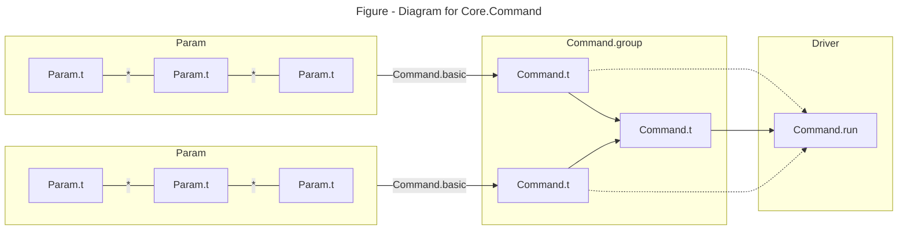
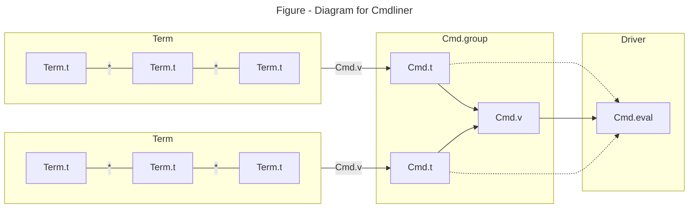

# Command-line Argparse

Unlike OCaml which itself is straightforward, command-line parse libraries e.g. `Core.Command` and `Cmdliner` in OCaml is notoriously difficult to understand and use. The tension may come from sometime people requires a quick solution, while both these libraries are shipping concepts and tools for a full-feathered tool. This post aims to provide alternative tutorials for them. Their official tutorials are at [RWO/Command-Line Parsing](https://dev.realworldocaml.org/command-line-parsing.html) and [cmdliner/tutorial](https://erratique.ch/software/cmdliner/doc/tutorial.html). OCaml also has build-in `Sys.argv` and standard library `Arg` module ([tutorial](https://ocaml.org/docs/cli-arguments)).

## What are the Driver Functions?

The first myth to break is they provide driver functions taking raw string of command-line and returning a parsing result. No!

`Core.Command` doesn't provide any driver functions at all. After all, `Core.Command` helps to build a `Command.t` which specifies:

- Step 2: how to parse command-line and get the parsed result
- Step 3: how to handle parsed result (and return a `unit`)

The driver function `Core.Command.run` , in `core_unix.command_unix`, takes the `Core.Command.t` and start the work:

- Step 1: take the commend-line `Sys.argv` and perform step 2 & 3.

`Cmdliner` has a variant of driver functions e.g. `Cmdliner.Cmd.eval` like the above step 1. They each takes a `Cmdliner.Cmd.t` like the above step 2 & 3 and returns a standard error code.

⚠️Warning: Since I don't understand the motivation of this design, I usually hack the driver functions and get the parsed result back via a mutable reference.

## How to Parse?

Both `Core.Command` and `Cmdliner` have two-layered compositional primitive functions

The inner layer for `Core.Command` is a compositional `Core.Command.Param.t` to compose single key-value parsing. e.g. a argparser for `-a=1 -b=t` is composed from a argparser for `-a=1` and a argparser `-b=t`. The inner layer for `Cmdliner` is a compositional `Cmdliner.Term.t`.

The inner layer data are wrapped into outer layer data `Core.Command.t` or `Cmdliner.Cmd.t` via packing function `Core.Command.basic` or `Cmdliner.Cmd.v`. A outer layer data is usually used for argparsing one command-line case. The outer layer data is also composable and are usually used to handle cases for sub-commands. [`Core.Command.group`](https://v3.ocaml.org/p/core/latest/doc/Core/Command/index.html#val-group) takes `(string * Core.Command.t) list` and returns a `Core.Command.t`. [`Cmdlinder.Cmd.group`](https://erratique.ch/software/cmdliner/doc/Cmdliner/Cmd/index.html#val-group) takes `Cmdliner.Cmd.t list` and returns a `Cmdliner.Cmd.t`.

## How `Command.Param.t` and `Cmdliner.Term.t` Composes

For smart readers who are familiar with typeclasspedia, both of `Command.Param.t` and `Cmdliner.Term.t` are _Contravariant_. They can compose just like how prettyprinter or parser combinator does.