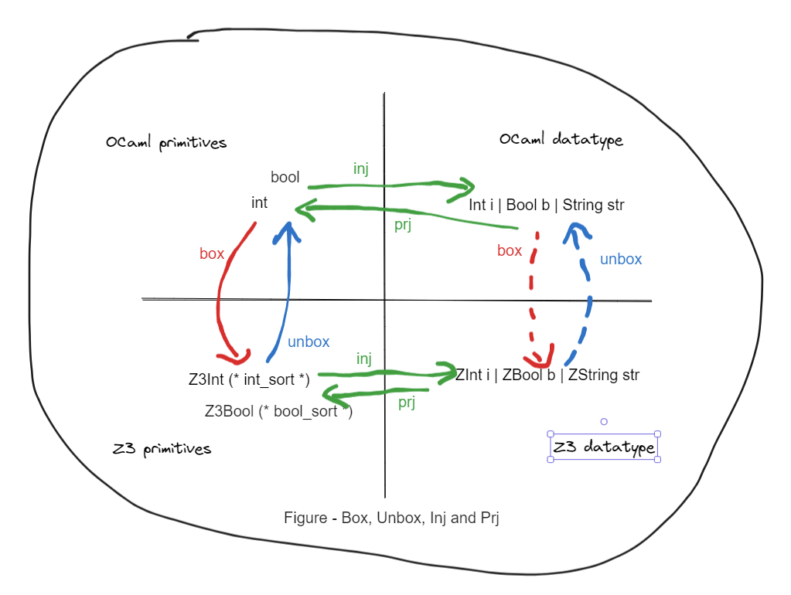

# Using `Z3.Datatype`

## Introduction

This post is for explaining some concepts and show usage for library [`ocaml-z3`](https://opam.ocaml.org/packages/z3/) and my library [`fairy_z3`](https://github.com/arbipher/ocaml_fairy_z3). My long-time goal is to make _Solve Anything_ easy in OCaml, and this is just a first step.

Roughly, z3 has coresponding data structures for _expressions_, _primitive types_ and _datatypes_, as like these in OCaml. I will not discuss the details of _logic_ or _theory_ used in a SMT solver Z3. We can just treat it as versatile library.

To clarify,

- _primitive types_ in OCaml, e.g. `int`, `boolean`, `float`, `string`.
- _datatypes_ in OCaml, variants or records, `type t1 = Foo of int * string | Bar of int`, `type t2 = {a : int; b : float}`.

In the current ocaml-z3 implementation, there is just one syntactic type `Z3.Expr.expr` for all z3 expressions and one syntactic type `Z3.Sort.sort` for the their types. To make this post more clear, we assume there is a better type definition that carries the correct sort of the expression. e.g. `Z3Int 42 : Z3_int_exp`. (It could be my second step for the long-time goal). Again,

- _primitive types_ in z3, e.g. `Z3_int`, `Z3_boolean`.
- _datatypes_ in Z3 e.g. `Z3_t1`, `Z3_t2`.

Both OCaml and z3 provide the ways to construct and operate on primitive types. In OCaml, a datatype is easy to define. However, it takes some effect to construct a datatype with ocaml-z3 and use it. That's what this post and `fairy_z3` targets.

## Box, Unbox, Inject, Project



(Mermaid cannot handle nicely diagram in this isometric layout so I have to use excalidraw..)

We have four arrow groups:

1. (Solid green lines) In the OCaml land, `inj`(inject) and `prj`(project) are supported by the language. Given the type `t1` above, `inj` is to construct from primitive values to a value in type `t1` and the `prj` is to pattern match a value in type `t1`.

2. (Solid red/blue lines) Between the primitive types of OCaml land and Z3 land. We choose the terms `box` and `unbox` to describe a value is to/from another representation in the perspective of OCaml. These functions are on-the-shelf.

```ocaml
let box_int : int -> Z3.Expr.expr = 
  fun i ->
    Z3.Arithmetic.Integer.mk_numeral_i ctx i

let unbox_int : Z3.Expr.expr -> int =
  fun e -> 
    e |> Z3.Arithmetic.Integer.get_big_int
      |> Big_int_Z.int_of_big_int
```
```mdx-error
Line 1, characters 22-34:
Error: Unbound module Z3
```

3. (Another solid green lines) In the Z3 land, `inj` and `prj` are achievable but tedious to write. We will demonstrate it in the later section and then advocate using `fairy_z3.ppx` to derive them instead.

4. (Dotten red/blue lines) Between the datatypes of OCaml land and Z3 land. The `box` and `unbox` for datatypes are made of the above three groups.

## Making Z3 Datatype by hand

Z3 has [tutorial](https://microsoft.github.io/z3guide/docs/theories/Datatypes/) and [api manual](https://z3prover.github.io/api/html/ml/Z3.Datatype.html). Now I cannot remember how I figured out how to use it. Some z3 issues definitely helped.

If you have a glance of its api, you can find `constructor`, `recognizer`, `accessor` as well as `sort` and `func_decl`. Conceptually, `func_decl` are _functions_ in **Z3 land** and `sort` are _types_ in **Z3 land**. `constructor`, `recognizer` and `accessor` are certain _functions_ and their functionalities are like the OCaml _functions_ around OCaml _datatypes_ but in **Z3 land**.

We first prepare the helper Z3 definitions in the group 2.

```ocaml
# #require "z3";;

# open Z3;;

# let ctx = mk_context [];;
val ctx : context = <abstr>
# let int_sort = Arithmetic.Integer.mk_sort ctx;;
val int_sort : Sort.sort = <abstr>
# let int_sort = Arithmetic.Integer.mk_sort ctx;;
val int_sort : Sort.sort = <abstr>
# let string_sort = Seq.mk_string_sort ctx;;
val string_sort : Sort.sort = <abstr>

# let box_int : int -> Z3.Expr.expr = 
  fun i ->
    Z3.Arithmetic.Integer.mk_numeral_i ctx i
val box_int : int -> Expr.expr = <fun>

# let unbox_int : Z3.Expr.expr -> int =
  fun e -> 
    e |> Z3.Arithmetic.Integer.get_big_int
      |> Big_int_Z.int_of_big_int
val unbox_int : Expr.expr -> int = <fun>

# let box_string s = Seq.mk_string ctx s;;
val box_string : string -> Expr.expr = <fun>
# let unbox_string e = Seq.get_string ctx e;;
val unbox_string : Expr.expr -> string = <fun>
```

Then we define the example type `t1`. We also write a few functions `ctor_*_ml`(constructor), `rzer_*_ml`(recognizer), `asor_*_ml`(accessor) in **OCaml land** just for illustrating.

```ocaml
# type t1 = Foo of int * string | Bar of int;;
type t1 = Foo of int * string | Bar of int

# let ctor_foo_ml (i,s) = Foo (i,s);;
val ctor_foo_ml : int * string -> t1 = <fun>
# let rzer_foo_ml = function | Foo (_, _) -> true | _ -> false;;
val rzer_foo_ml : t1 -> bool = <fun>
# let asor_foo_0_ml = function | Foo (i, _) -> i | _ -> failwith "only foo";;
val asor_foo_0_ml : t1 -> int = <fun>
```

Now we are in **Z3 land**. We can make the constructors and the _sort_.

```ocaml
# Datatype.mk_constructor_s;;
- : context ->
    string ->
    Symbol.symbol ->
    Symbol.symbol list ->
    Sort.sort option list -> int list -> Datatype.Constructor.constructor
= <fun>

# let ctor_foo = Datatype.mk_constructor_s ctx "Foo" 
  (Symbol.mk_string ctx "is-Foo")
  [ Symbol.mk_string ctx "Foo-0"; Symbol.mk_string ctx "Foo-1" ]
  [ Some int_sort; Some string_sort ]
  [ 1; 1 ];;
val ctor_foo : Datatype.Constructor.constructor = <abstr>

# let ctor_bar = Datatype.mk_constructor_s ctx "Bar"
  (Symbol.mk_string ctx "is-Bar")
  [ Symbol.mk_string ctx "Bar-0" ]
  [ Some int_sort ] [ 1 ];;
val ctor_bar : Datatype.Constructor.constructor = <abstr>

# let t1_sort = Datatype.mk_sort_s ctx "t1_sort" [ ctor_foo; ctor_bar ];;
val t1_sort : Sort.sort = <abstr>
```

We make a constructor for each variant tag e.g. `ctor_foo` and in each tag we specify each payload type e.g. `int` (in `Foo of int * string) its name, sort, and whether it's recursive (non-zero means non-recursive).

A constructor is a variant tag description that used to make a sort. To apply a constructore, we need to first get the associated function a.k.a. `func_decl` in Z3 land. Then we _apply_ this function in Z3 land via `FuncDecl.apply`.

```ocaml
# let ctor_f_foo = Datatype.Constructor.get_constructor_decl ctor_foo;;
val ctor_f_foo : FuncDecl.func_decl = <abstr>
# let ctor_f_bar = Datatype.Constructor.get_constructor_decl ctor_bar;;
val ctor_f_bar : FuncDecl.func_decl = <abstr>

# let e1_ = Foo (42, "camel");;
val e1_ : t1 = Foo (42, "camel")

# let e1 = ctor_foo_ml (42, "camel");;
val e1 : t1 = Foo (42, "camel")

# let e1_z3 = FuncDecl.apply ctor_f_foo [box_int 42; box_string "camel"];;
val e1_z3 : Expr.expr = <abstr>

# Expr.to_string e1_z3;;
- : string = "(Foo 42 \"camel\")"
```

Now we have already make a Z3 expression of `t1_sort`. We can also make constraint and solve on it. e.g. we can ask to solve `(Foo x "camel") == (Foo 42 "camel")` then `x` is `42`.

```ocaml
# let solver = Solver.mk_solver ctx None;;
val solver : Solver.solver = <abstr>

# let e2_z3 = FuncDecl.apply ctor_f_foo [Arithmetic.Integer.mk_const_s ctx "x"; box_string "camel"];;
val e2_z3 : Expr.expr = <abstr>

# let solver_result = Solver.check solver [Boolean.mk_eq ctx e1_z3 e2_z3];;
val solver_result : Solver.status = Z3.Solver.SATISFIABLE

# match solver_result with Solver.SATISFIABLE -> 
  (match Solver.get_model solver with 
    | Some model -> Model.to_string model
    | None -> "no model")
  | _ -> "not sat";;
- : string = "(define-fun x () Int\n  42)"
```

Now we have all the ingredients to write `inj` functions in Z3 land and the `box` from OCaml to Z3.

```ocaml
# let inj_foo (ei,es) = FuncDecl.apply ctor_f_foo [ei; es];;
val inj_foo : Expr.expr * Expr.expr -> Expr.expr = <fun>
# let inj_bar ei = FuncDecl.apply ctor_f_bar [ei];;
val inj_bar : Expr.expr -> Expr.expr = <fun>
# let box_t1 = function 
  | Foo (i,s) -> inj_foo (box_int i, box_string s) 
  | Bar i -> inj_bar (box_int i);;
val box_t1 : t1 -> Expr.expr = <fun>

# box_t1 (Foo (101, "dog")) |> Expr.to_string;;
- : string = "(Foo 101 \"dog\")"
```

`rzer_*`(recognizer) and `asor_*`(accessor) are got from `t1_sort`.

```ocaml
# #show t1;;
type nonrec t1 = Foo of int * string | Bar of int

# let rzer_foo, rzer_bar = 
  match Datatype.get_recognizers t1_sort with 
  | [ rzer_foo; rzer_bar ] -> (rzer_foo, rzer_bar) 
  | _ -> failwith "recogniziers mismatch";;
val rzer_foo : FuncDecl.func_decl = <abstr>
val rzer_bar : FuncDecl.func_decl = <abstr>

# let (asor_foo_0, asor_foo_1), asor_bar_0 = 
  match Datatype.get_accessors t1_sort with 
  | [ [ asor_foo_0; asor_foo_1 ]; [ asor_bar_0 ] ] -> ((asor_foo_0, asor_foo_1), (asor_bar_0)) 
  | _ -> failwith "accessors mismatch";;
val asor_foo_0 : FuncDecl.func_decl = <abstr>
val asor_foo_1 : FuncDecl.func_decl = <abstr>
val asor_bar_0 : FuncDecl.func_decl = <abstr>
```

Recognizers share the shape of variant cases. Accessors share the shape of variant cases and the inner payload types. It's also the same shape with the constructors.

```ocaml
# let ei = FuncDecl.apply rzer_foo [e1_z3];;
val ei : Expr.expr = <abstr>

# Expr.to_string ei;;
- : string = "((_ is Foo) (Foo 42 \"camel\"))"
```

Here comes the subtle question. `FuncDecl.apply` builds a function application in Z3 land, but it's just an unevaluated expression.

```ocaml
# let unbox_bool v = match Boolean.get_bool_value v with | L_TRUE -> true | L_FALSE -> false | _ -> failwith "L_UNDEF";;
val unbox_bool : Expr.expr -> bool = <fun>

# unbox_bool ei;;
Exception: Failure "L_UNDEF".
```

It's not a problem for the box direction because we can __evaluate__ in OCaml land, box the result, and build the Z3 expression. To force the __evaluation__ in Z3 land, we can use `Expr.simplify ctx`.

```ocaml
# let ei' = Expr.simplify ei None;;
val ei' : Expr.expr = <abstr>

# Expr.to_string ei';;
- : string = "true"

# unbox_bool ei';;
- : bool = true
```

Now we have all the ingredients to write `prj` functions in Z3 land and the `unbox` from Z3 to OCaml.

```ocaml
# let is_foo e = FuncDecl.apply rzer_foo [ e ];;
val is_foo : Expr.expr -> Expr.expr = <fun>
# let prj_foo_0 e = FuncDecl.apply asor_foo_0 [ e ];;
val prj_foo_0 : Expr.expr -> Expr.expr = <fun>
# let prj_foo_1 e = FuncDecl.apply asor_foo_1 [ e ];;
val prj_foo_1 : Expr.expr -> Expr.expr = <fun>

# let is_bar e = FuncDecl.apply rzer_bar [ e ];;
val is_bar : Expr.expr -> Expr.expr = <fun>
# let prj_bar_0 e = FuncDecl.apply asor_bar_0 [ e ];;
val prj_bar_0 : Expr.expr -> Expr.expr = <fun>

# let unbox_t1 e = 
      match e with
      | _ when Expr.simplify (is_foo e) None |> unbox_bool ->
          Foo
            ( Expr.simplify (prj_foo_0 e) None |> unbox_int,
              Expr.simplify (prj_foo_1 e) None |> unbox_string )
      | _ when Expr.simplify (is_bar e) None |> unbox_bool ->
          Bar
            ( Expr.simplify (prj_bar_0 e) None |> unbox_int )
      | _ -> failwith "not here";;
val unbox_t1 : Expr.expr -> t1 = <fun>

# unbox_t1 e1_z3;;
- : t1 = Foo (42, "camel")
```

All set for our expected functions!

## Making Z3 Datatype by fairy magic

If you don't want to write the above functions, just use `fairy_z3.ppx`. To check the generated function, change `[@@deriving ..]` to `[@@deriving_inline ..] [@@@end]`.

```ocaml
type t1 = Foo of int * string | Bar of int
[@@deriving z3 ~flag ~bv_width:52]
```

## Summary and To-do

- [ ] Read (ocaml-)z3 source code to understand its datatype API better.
- [ ] Support more type constructors in OCaml.
- [ ] Allow more customizing for primitives box and unbox function.
- [ ] Make it more easier to use.
- [ ] Add more testing.
